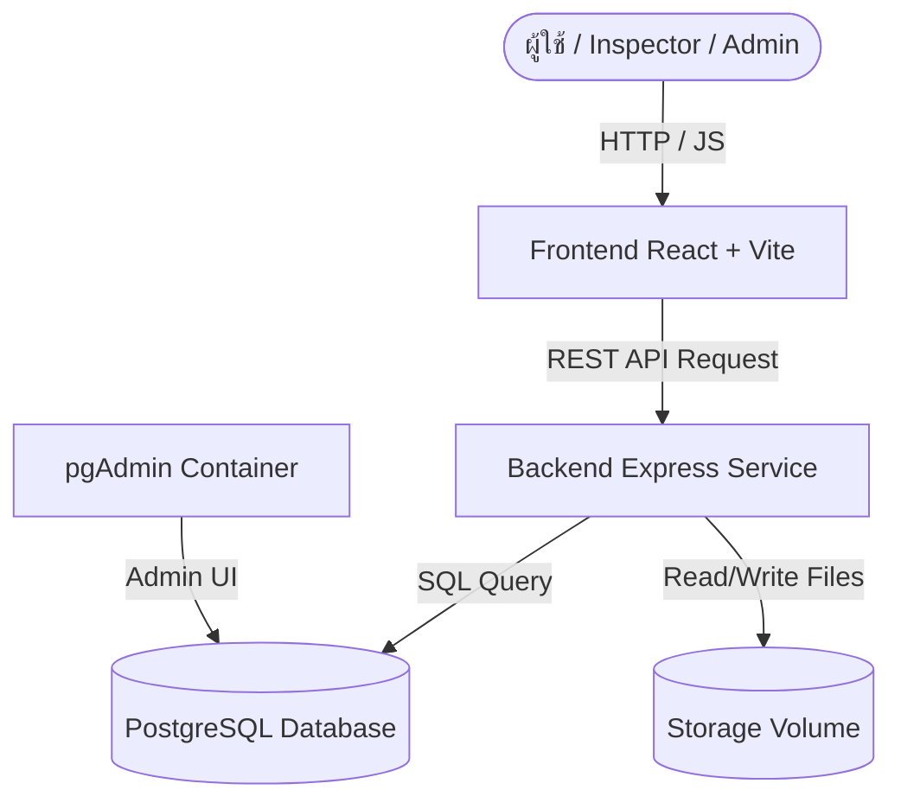

# 📄 เอกสารการออกแบบระบบและคู่มือนักพัฒนา (System Design & Developer Documentation)

เอกสารนี้ระบุรายละเอียดทางเทคนิคของระบบ **NetOps Portal (RPM App)** สำหรับนักพัฒนาที่ต้องการทำความเข้าใจสถาปัตยกรรม โครงสร้างฐานข้อมูล พฤติกรรมการจัดเก็บรูปภาพ และข้อกำหนดการสื่อสารผ่าน API (API Specification)

---

## 🏛️ สถาปัตยกรรมระบบ (System Architecture)

ระบบถูกออกแบบด้วยสถาปัตยกรรมแบบ **Client-Server Architecture** และคอนเทนเนอร์ไรเซชัน (Containerization):

### รายละเอียดของบริการใน Docker Compose
1. **db (postgres:15-alpine)**: ทำหน้าที่เก็บข้อมูลเชิงโครงสร้างทั้งหมด มีการนำเข้าสคริปต์ `init.sql` เมื่อเริ่มต้น และใช้ Volume `postgres_data` เพื่อเก็บข้อมูลถาวร
2. **backend (Express.js)**: รันอยู่บน Node.js เป็นศูนย์กลางการทำงานของระบบ ทำหน้าที่เชื่อมต่อฐานข้อมูล ตรวจสอบข้อมูล นำเข้าและแปลงไฟล์รูปภาพ ประมวลผลข้อความผ่าน OCR และส่งออกรายงานในรูป PDF
3. **frontend (React + Vite)**: ให้บริการหน้าจอผู้ใช้งานในโหมด Development (หรือ Nginx สำหรับ Production) เชื่อมต่อ API เพื่อบันทึกข้อมูลและแสดงผล
4. **pgadmin (pgAdmin 4)**: เว็บอินเทอร์เฟซแบบ GUI สำหรับผู้ดูแลระบบในการเข้าไปจัดการตารางข้อมูล

---

## 🗄️ โครงสร้างฐานข้อมูล (Database Schema Spec)

ระบบทำงานบน PostgreSQL โดยประกอบด้วย 8 ตารางหลักดังนี้:

### 1. `users` (ตารางผู้ใช้และการอนุญาตสิทธิ์)
เก็บข้อมูลผู้ใช้งานที่เชื่อมต่อผ่านระบบและบทบาทหน้าที่
* `user_id` (SERIAL PRIMARY KEY)
* `email` (VARCHAR(255) UNIQUE)
* `name` (VARCHAR(255))
* `role` (VARCHAR(50)) - สิทธิ์การเข้าถึง: `Admin`, `Inspector`, `Viewer`

### 2. `sites` (ข้อมูลสถานีหลัก)
ตารางบันทึกรายชื่อสถานีที่ต้องเข้าตรวจ
* `site_id` (SERIAL PRIMARY KEY)
* `site_code` (VARCHAR(50) UNIQUE) - เช่น `BKK-999`, `CM-002`
* `site_name` (VARCHAR(255))
* `site_grade` (VARCHAR(10)) - ระดับของสถานี เช่น `A`, `B`, `C`
* `site_type` (VARCHAR(50)) - ประเภทพื้นที่ เช่น `Indoor`, `Outdoor`

### 3. `rpm_records_master` (หัวข้อใบงานตรวจรับ)
ตารางหลักที่ผูกโยงข้อมูลการตรวจรับในรอบนั้น ๆ
* `rpm_id` (SERIAL PRIMARY KEY)
* `site_code` (VARCHAR(50) REFERENCES sites)
* `job_number_sl6` (VARCHAR(100) UNIQUE) - เลขที่ SL6 ของใบงาน
* `sap_number` (VARCHAR(100)) - เลขที่อ้างอิงของ SAP
* `rpm_cycle` (VARCHAR(50)) - รอบการตรวจ เช่น `2026-R1`
* `status` (VARCHAR(50)) - สถานะ เช่น `Pending`, `Submitted`

### 4. `power_main_ac` (การตรวจวัดระบบไฟฟ้ากระแสสลับหลัก)
เก็บค่าแรงดันไฟฟ้าและคุณภาพของไฟฟ้าเมนหลัก
* `main_ac_id` (SERIAL PRIMARY KEY)
* `rpm_id` (INT UNIQUE REFERENCES rpm_records_master)
* ข้อมูลการวัด: `voltage_p1`, `voltage_p2`, `voltage_p3` (แรงดันรายเฟส)
* กระแสไฟฟ้า: `current_p1`, `current_p2`, `current_p3` (NUMERIC)
* ลิงก์รูปภาพ: `meter_ac_img`, `cable_img`, `change_over_img`, `surge_img`, `mdb_temp_img` (VARCHAR(500)[])

### 5. `power_rectifier` (ระบบตู้แปลงกระแสไฟฟ้า)
ข้อมูลตู้ Rectifier แยกรายตู้ (1 ใบงาน มีได้หลายตู้)
* `rect_id` (SERIAL PRIMARY KEY)
* `rpm_id` (INT REFERENCES rpm_records_master)
* `rect_no` (VARCHAR(50)) - ลำดับตู้ เช่น `rect_1`
* ข้อมูลจำเพาะ: `model`, `ac_cable_size`, `breaker_size`
* ผลการวัด: `input_current_ac`, `output_current_dc`
* รายละเอียดแบตเตอรี่: `battery_type`, `lithium_capacity`, `battery_qty_bank`

### 6. `rectifier_banks` (ชุดแบตเตอรี่ในแต่ละตู้ Rectifier)
ข้อมูลธนาคารแบตเตอรี่ (1 ตู้ มีได้หลาย Bank)
* `bank_id` (SERIAL PRIMARY KEY)
* `rect_id` (INT REFERENCES power_rectifier)
* `bank_name` (VARCHAR(50)) - ลำดับแบงก์ เช่น `bank_1`
* ข้อมูลทั่วไป: `brand`, `capacity`, `installed_date`, `warrantee_date`

### 7. `battery_tests` (การวัดค่าแบตเตอรี่รายก้อน)
* สำหรับเก็บผลวิเคราะห์ค่าแรงดันและค่าความต้านทานภายในรายก้อนเพื่อตรวจสอบความเสื่อมสภาพ

### 8. `systems_and_facilities` (ความปลอดภัยและระบบระบายอากาศ)
* เก็บผลการประเมิน อุณหภูมิ พัดลม แอร์ สภาพตึก และความสะอาด พร้อมที่อยู่ไฟล์ภาพถ่ายอ้างอิง

---

## 🔌 ข้อกำหนดทางเทคนิคของ API (API Reference Specification)

ทุกจุดให้บริการปลายทาง (API Endpoints) จะใช้คำนำหน้าทางผ่านเป็น `/api`

### 🔐 1. Authentication & Users
* **`POST /api/auth/google`**: ใช้ยืนยันตัวตนผ่าน Google Identity Token และลงทะเบียนผู้ใช้ใหม่
* **`GET /api/users`**: ดึงรายชื่อผู้ใช้ทั้งหมดในระบบ (เฉพาะ Admin)
* **`POST /api/users/update-role`**: อัปเดตบทบาทของสมาชิก (`Admin`, `Inspector`, `Viewer`)

### 🏢 2. Site Management
* **`GET /api/sites`**: แสดงรายการสถานีทั้งหมด
* **`POST /api/sites`**: เพิ่มสถานีใหม่รายเดี่ยว
* **`POST /api/sites/bulk`**: นำเข้าข้อมูลสถานีจำนวนมากพร้อมกันผ่านรูปแบบ Array JSON
* **`PUT /api/sites/:site_id`**: แก้ไขข้อมูลสถานี

### 📝 3. Work Order Life Cycle (วงจรใบงาน)
* **`GET /api/workorders/active`**: ดึงใบงานที่ยังทำไม่เสร็จหรือกำลังดำเนินการอยู่ (`Pending`)
* **`GET /api/workorders/all`**: ดึงรายการใบงานทั้งหมดในระบบ
* **`POST /api/workorder/start`**: สร้างและเริ่มต้นใบงานใหม่ (รับค่า `site_code`, `job_number_sl6`, `sap_number`, `rpm_cycle`)
* **`GET /api/workorder/:rpm_id/master`**: ดึงรายละเอียดหัวข้อใบงานหลัก
* **`PUT /api/workorder/:rpm_id/master`**: อัปเดตข้อมูลใบงานหลัก
* **`POST /api/workorder/:rpm_id/submit`**: ทำการส่งใบงานเพื่อล็อกข้อมูล (`Submitted`) ห้ามแก้ไขเว้นแต่จะมีการขอปลดล็อก
* **`POST /api/workorder/:rpm_id/unlock`**: ปลดล็อกใบงานกลับเป็น `Pending` เพื่อให้เข้ามาทำการแก้ไขได้

### 📑 4. Form Data Entries (การป้อนข้อมูลแยกหัวข้อ)
ทุก Endpoint ด้านล่างรองรับ Multipart Form Data เพื่ออัปโหลดไฟล์รูปภาพพร้อมบันทึกฟิลด์ข้อมูล:
* **`POST /api/workorder/:rpm_id/ac`**: บันทึกข้อมูลและอัปโหลดภาพชุดระบบเมน AC
* **`POST /api/workorder/:rpm_id/rectifier`**: บันทึกข้อมูลและอัปโหลดภาพชุดตู้ Rectifier
* **`POST /api/rectifier/:rect_id/battery`**: บันทึกรูปภาพและผลการทดสอบแบตเตอรี่ในแต่ละช่อง (Cell 1 - Cell 4)
* **`POST /api/workorder/:rpm_id/facilities`**: บันทึกชุดพัดลมระบายอากาศ, แอร์, และภาพถ่ายความเรียบร้อยรอบสถานี

### 📦 5. File System & Backup API
* **`GET /api/storage/browse`**: เบราส์ดูโครงสร้างโฟลเดอร์ไฟล์ภาพของไซต์ต่าง ๆ ในเซิร์ฟเวอร์
* **`GET /api/storage/download-folder`**: ดาวน์โหลดโฟลเดอร์ของไซต์นั้น ๆ ในรูปของไฟล์บีบอัด Zip
* **`POST /api/storage/download-selected`**: ดาวน์โหลดชุดไฟล์ที่เลือกแบบ Zip
* **`DELETE /api/storage/delete`**: ลบไฟล์หรือโฟลเดอร์ออกจาก Storage (เฉพาะ Admin เท่านั้น)

---

## 🛠️ ระบบประมวลผลพิเศษ (Specialized Services)

### 1. ระบบประมวลผล OCR (Tesseract.js)
หลังบ้านได้ผสานโมดูล OCR เข้ามาช่วยดึงข้อความที่เป็นตัวเลขโดยอัตโนมัติจากภาพถ่ายหน้าปัดมิเตอร์ โดยการดึงภาพและเปลี่ยนสีให้มีคอนทราสต์เหมาะสมก่อนส่งให้โมเดลถอดข้อมูล

### 2. ระบบสร้างเอกสารอัตโนมัติ (PDF Generator Service)
ใช้ `pdfkit` เพื่อเรนเดอร์เอกสารใบสรุปงานเป็นรายงานทางการขนาด A4 เมื่อผู้ใช้งานกดดาวน์โหลด โดยมีรูปแบบมาตรฐานที่จัดตำแหน่งข้อมูล ชื่อผู้ตรวจ รูปภาพถ่ายก่อน-หลัง และแนบพิกัดประวัติของสถานที่นั้นลงในเอกสาร

---

## ⚠️ แนวปฏิบัติสำหรับนักพัฒนา (Developer Checklist)

1. **การปรับแต่งฐานข้อมูล**: หากจำเป็นต้องเพิ่มฟิลด์ลงฐานข้อมูล ให้ปรับปรุงสคริปต์ลงใน `init.sql` ทุกครั้ง และปรับโมเดล Schema ใน API
2. **การตั้งชื่อไฟล์รูปภาพ**: การอัปโหลดรูปภาพใหม่จะถูกนำไปคลีนชื่อให้อยู่ในรูปแบบ UTF-8/สากลเสมอ เพื่อป้องกันข้อผิดพลาดกรณีนำไปดาวน์โหลดบน OS ต่างระบบ
3. **การทดสอบ API**: สามารถรันเซิร์ฟเวอร์ในโหมดพัฒนาผ่าน `npm run dev` ในโฟลเดอร์ `backend-node` เพื่อทำการดีบั๊กผ่าน Terminal
